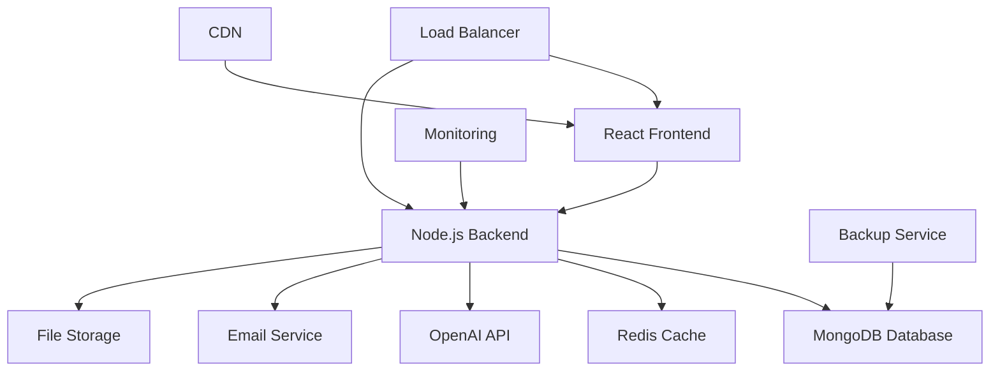

# 📧 MailFlow - AI-Powered Email Marketing Platform

<div align="center">

```
    ███╗   ███╗ █████╗ ██╗██╗     ███████╗██╗      ██████╗ ██╗    ██╗
    ████╗ ████║██╔══██╗██║██║     ██╔════╝██║     ██╔═══██╗██║    ██║
    ██╔████╔██║███████║██║██║     █████╗  ██║     ██║   ██║██║ █╗ ██║
    ██║╚██╔╝██║██╔══██║██║██║     ██╔══╝  ██║     ██║   ██║██║███╗██║
    ██║ ╚═╝ ██║██║  ██║██║███████╗██║     ███████╗╚██████╔╝╚███╔███╔╝
    ╚═╝     ╚═╝╚═╝  ╚═╝╚═╝╚══════╝╚═╝     ╚══════╝ ╚═════╝  ╚══╝╚══╝
```

<h3>🚀 Next-Generation Email Marketing with AI</h3>
<p><em>The future of email marketing is here - powered by artificial intelligence</em></p>

[](https://github.com/your-repo/mailflow)
[](https://reactjs.org/)
[](https://nodejs.org/)
[](https://mongodb.com/)
[](https://openai.com/)
[](https://docker.com/)

</div>

## ✨ Features

### 🤖 AI-Powered Marketing
- **Smart Content Generation**: AI-generated email content with GPT-4
- **Subject Line Optimization**: AI-powered subject line suggestions and A/B testing
- **Send Time Optimization**: Machine learning-based optimal send time prediction
- **Personalization Engine**: Dynamic content personalization using AI
- **Performance Analytics**: AI-driven campaign performance insights

### 📊 Advanced Analytics
- **Real-time Dashboard**: Beautiful, responsive analytics dashboard
- **Engagement Tracking**: Open rates, click rates, conversion tracking
- **A/B Testing Suite**: Comprehensive testing with AI-powered winner selection
- **Predictive Analytics**: Forecast campaign performance and engagement
- **Custom Reports**: Generate detailed performance reports

### 👥 Contact Management
- **Smart Segmentation**: AI-powered audience segmentation
- **Lead Scoring**: Automatic lead scoring based on engagement
- **Contact Profiles**: Detailed contact profiles with engagement history
- **Import/Export**: Bulk contact management with CSV support
- **GDPR Compliance**: Built-in compliance features

### 🎨 Design & User Experience
- **Modern UI**: Clean, modern interface inspired by ConvertKit and Beehiiv
- **Drag & Drop Editor**: Visual email template builder
- **Mobile Responsive**: Perfect display on all devices
- **Dark Mode**: Built-in dark mode support
- **Accessibility**: WCAG 2.1 compliant interface

### 🔧 Developer Features
- **REST API**: Complete RESTful API for integrations
- **Webhook Support**: Real-time event notifications
- **SDK Support**: JavaScript/Node.js SDK
- **Database Agnostic**: MongoDB with easy migration support
- **Microservices Ready**: Scalable architecture

## 🚀 Quick Start

### Prerequisites

- Node.js 18+ 
- MongoDB 7+
- Redis (optional, for caching)
- OpenAI API Key (for AI features)

### Installation

1. **Clone the repository**
   ```bash
   git clone https://github.com/your-repo/mailflow.git
   cd mailflow
   ```

2. **Install dependencies**
   ```bash
   # Install frontend dependencies
   npm install
   
   # Install backend dependencies
   cd backend
   npm install
   cd ..
   ```

3. **Setup environment variables**
   ```bash
   # Copy environment template
   cp backend/.env.example backend/.env
   
   # Edit with your configuration
   nano backend/.env
   ```

4. **Start the application**
   ```bash
   # Development mode (starts both frontend and backend)
   npm run dev
   
   # Or start separately
   npm start                    # Frontend (React)
   cd backend && npm run dev    # Backend (Node.js)
   ```

### 🐳 Docker Setup

The easiest way to get started is with Docker:

```bash
# Start all services
docker-compose up -d

# View logs
docker-compose logs -f

# Stop services
docker-compose down
```

## 📖 Configuration

### Environment Variables

Create a `.env` file in the backend directory:

```env
# Application
NODE_ENV=development
PORT=8000
FRONTEND_URL=http://localhost:3000

# Database
MONGODB_URI=mongodb://localhost:27017/mailflow
REDIS_URL=redis://localhost:6379

# Authentication
JWT_SECRET=your-super-secret-jwt-key
JWT_EXPIRE=7d
JWT_REFRESH_SECRET=your-refresh-token-secret
JWT_REFRESH_EXPIRE=30d

# Email Service (choose one)
# SendGrid
SENDGRID_API_KEY=your-sendgrid-api-key
SENDGRID_FROM_EMAIL=noreply@yourapp.com
SENDGRID_FROM_NAME=MailFlow

# SMTP (Alternative)
SMTP_HOST=smtp.gmail.com
SMTP_PORT=587
SMTP_USER=your-email@gmail.com
SMTP_PASS=your-app-password

# AI Features
OPENAI_API_KEY=your-openai-api-key
OPENAI_MODEL=gpt-4
OPENAI_MAX_TOKENS=1000

# File Upload
MAX_FILE_SIZE=10485760
ALLOWED_FILE_TYPES=jpg,jpeg,png,gif,pdf

# Security
BCRYPT_SALT_ROUNDS=12
RATE_LIMIT_WINDOW_MS=900000
RATE_LIMIT_MAX_REQUESTS=100
```

## 🚀 Deployment

### One-Click Deployment

Use our deployment script for easy deployment to various platforms:

```bash
# Make script executable
chmod +x deploy.sh

# Interactive deployment
./deploy.sh

# Or deploy to specific platform
./deploy.sh railway    # Railway
./deploy.sh vercel     # Vercel (frontend only)
./deploy.sh docker     # Docker
./deploy.sh heroku     # Heroku
```

### Manual Deployment Options

#### Railway (Recommended)
```bash
# Install Railway CLI
npm install -g @railway/cli

# Login and deploy
railway login
railway up
```

#### Vercel (Frontend)
```bash
# Install Vercel CLI
npm install -g vercel

# Deploy
npm run build
vercel --prod
```

#### Docker Production
```bash
# Build and run
docker-compose -f docker-compose.yml -f docker-compose.prod.yml up -d
```

## 📚 API Documentation

### Authentication

All API endpoints require authentication via JWT tokens:

```javascript
// Login
POST /api/auth/login
{
  "email": "user@example.com",
  "password": "password123"
}

// Response
{
  "success": true,
  "data": {
    "user": {...},
    "token": "jwt-token",
    "refreshToken": "refresh-token"
  }
}
```

### Campaigns

```javascript
// Create campaign
POST /api/campaigns
Authorization: Bearer <token>
{
  "name": "Summer Sale 2024",
  "subject": "🌞 Summer Sale - 50% Off!",
  "content": {
    "html": "<h1>Summer Sale</h1>...",
    "text": "Summer Sale..."
  },
  "recipients": {
    "type": "all_contacts"
  }
}

// Get campaigns
GET /api/campaigns
Authorization: Bearer <token>

// Campaign analytics
GET /api/campaigns/:id/analytics
Authorization: Bearer <token>
```

### AI Features

```javascript
// Generate email content
POST /api/ai/generate-content
Authorization: Bearer <token>
{
  "prompt": "Create a promotional email for summer sale",
  "context": {
    "industry": "retail",
    "tone": "friendly",
    "targetAudience": "young adults"
  }
}

// Generate subject lines
POST /api/ai/generate-subjects
Authorization: Bearer <token>
{
  "emailContent": "Email content here...",
  "context": {
    "campaignType": "promotional"
  }
}
```

## 🏗️ Architecture



### Tech Stack

**Frontend:**
- React 18 with Hooks
- React Router for navigation
- React Query for state management
- Tailwind CSS for styling
- Lucide React for icons
- React Hook Form for forms

**Backend:**
- Node.js with Express
- MongoDB with Mongoose
- JWT for authentication
- OpenAI GPT-4 integration
- SendGrid/Nodemailer for emails
- Redis for caching
- Multer for file uploads

**DevOps:**
- Docker & Docker Compose
- GitHub Actions CI/CD
- Railway/Vercel deployment
- MongoDB Atlas
- Nginx reverse proxy

## 🧪 Testing

```bash
# Frontend tests
npm test

# Backend tests
cd backend
npm test

# Run all tests
npm run test:all

# Coverage report
npm run test:coverage
```

## 🤝 Contributing

We welcome contributions! Please see our [Contributing Guide](CONTRIBUTING.md) for details.

1. Fork the repository
2. Create your feature branch (`git checkout -b feature/amazing-feature`)
3. Commit your changes (`git commit -m 'Add amazing feature'`)
4. Push to the branch (`git push origin feature/amazing-feature`)
5. Open a Pull Request

## 📄 License

This project is licensed under the MIT License - see the [LICENSE](LICENSE) file for details.

## 🆘 Support

- **Documentation**: [Full Documentation](https://docs.mailflow.com)
- **Issues**: [GitHub Issues](https://github.com/your-repo/mailflow/issues)
- **Discussions**: [GitHub Discussions](https://github.com/your-repo/mailflow/discussions)
- **Email**: support@mailflow.com

## 🙏 Acknowledgments

- [OpenAI](https://openai.com) for AI capabilities
- [ConvertKit](https://convertkit.com) for UI inspiration
- [Beehiiv](https://beehiiv.com) for design inspiration
- [Mailchimp](https://mailchimp.com) for functionality reference

---

<div align="center">

**Built with ❤️ by the MailFlow Team**

[⭐ Star us on GitHub](https://github.com/your-repo/mailflow) | [🐦 Follow us on Twitter](https://twitter.com/mailflow) | [💬 Join our Discord](https://discord.gg/mailflow)

</div>
